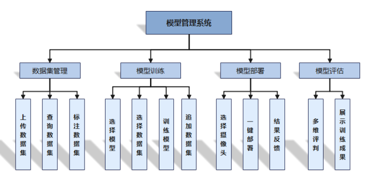

<h1 align="center" style="margin: 30px 0 30px; font-weight: bold;">图安校园模型管理平台 v1.0</h1>
<h4 align="center">基于Vue开发的管理平台</h4>

## 平台简介

图安校园模型管理平台，采用vue框架，实现了与图安校园安防综合管理平台[tuan-admin-ui](https://github.com/QJC1123/tuan-admin-ui)对接的移动解决方案！模型管理平台提供给模型管理员管理数据集，管理训练模型的功能，并对模型进行评估和部署，还可以进行模型的更新、迭代与功能扩展。 属于“校园安防智能保障系统”的平台之一，“校园安防智能保障系统”项目获第十四届服务外包创新创业大赛**国家级二等奖**。

平台目前已经实现数据集管理、模型训练、模型部署等功能。

* 应用框架基于[vue](https://cn.vuejs.org/guide/introduction.html)。
* 前端组件采用[element-ui](https://www.uihtm.com/element/#/zh-CN)，全端兼容的高性能UI框架。

## 功能模块

1. 数据集管理 
    可上传并查询数据集，支持数据集标注与管理。

2. 模型训练 
    可选择数据集和模型，进行训练，支持追加数据集进行训练。

3. 模型评估 
    可进行多维评判模型并展示训练成果。

4. 模型部署 
    可以选择摄像头进行一键模型部署与部署接果反馈。

## 演示图

#### 1. 平台概览
* 功能说明： 
    呈现平台的概览信息。
* 操作说明： 
    登录模型管理系统，点击首页模块，查看平台概览信息

  
 
#### 2. 数据集管理
* 功能说明： 
    可以查看数据集的详细信息，包括数据集名称、状态和种类等。
* 操作说明： 
    登录模型管理系统,进行数据集管理操作

  

#### 3. 模型训练
* 功能说明： 
    可以查看模型训练的详细信息，可以新增或删除模型训练模板，查看模型训练传输信息。
* 操作说明： 
    登录模型管理系统，点击模型训练模板界面，增删改查模型训练

  
  

#### 4. 模型评估
* 功能说明： 
    可以查看平台推送至设备的模型评估数据信息。
* 操作说明： 
    登录模型管理系统,点击模型评估界面,查看模型评估情况。 
 

#### 5. 模型部署
* 功能说明： 
    可以查看平台推送至设备的模型部署信息。
* 操作说明： 
    登录模型管理系统,点击模型部署界面,查看模型部署情况。
 

## 开发
        # 克隆项目
        git clone https://github.com/QJC1123/tuan-model-master

        # 进入项目目录
        cd tuan-model-master

        # 安装依赖
        npm install

        # 启动服务
        npm run dev

